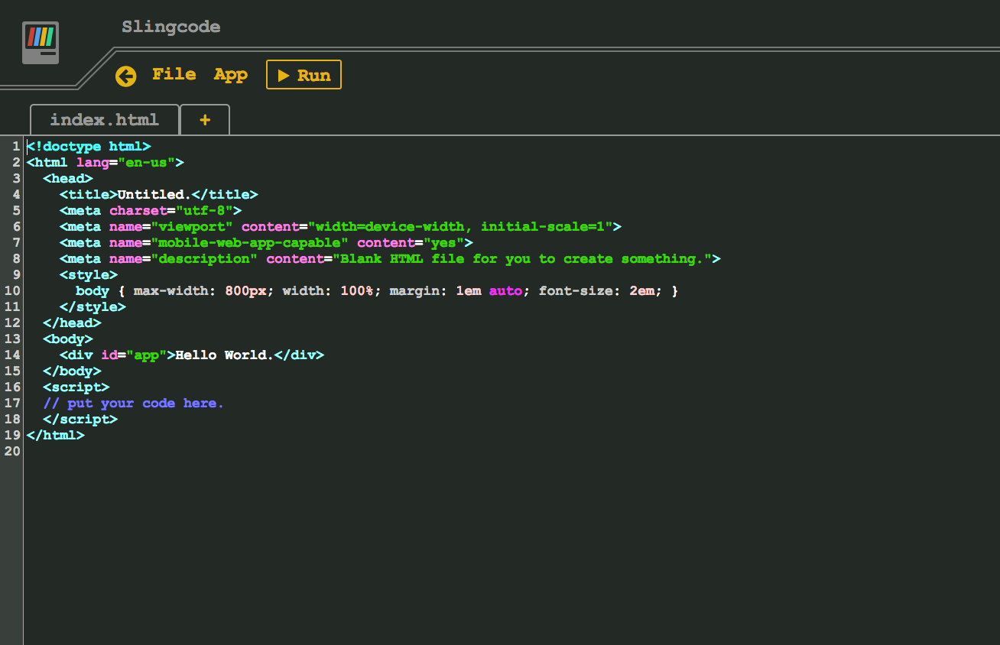

# Slingcode for YunoHost

[](https://dash.yunohost.org/appci/app/slingcode)    
[](https://install-app.yunohost.org/?app=slingcode)

*[Lire ce readme en français.](./README_fr.md)*

> *This package allow you to install Slingcode quickly and simply on a YunoHost server.  
If you don't have YunoHost, please see [here](https://yunohost.org/#/install) to know how to install and enjoy it.*

## Overview

Slingcode is a code editor contained in a single HTML file. Therefore, it has no server component, so all of your data is stored in your browser's cache. However, it is still possible to make web apps, run them, export them, and even share them using peer-to-peer.

**Shipped version:** 0.2.2

## Screenshots



## Demo

* [Official demo](https://slingcode.net/slingcode.html)

## Documentation

 * Official documentation: https://slingcode.net/screencasts.html

#### Supported architectures

* x86-64 - [](https://ci-apps.yunohost.org/ci/apps/slingcode/)
* ARMv8-A - [](https://ci-apps-arm.yunohost.org/ci/apps/slingcode/)

## Links

 * Report a bug: https://github.com/YunoHost-Apps/slingcode_ynh/issues
 * App website: https://slingcode.net/
 * Upstream app repository: https://github.com/chr15m/slingcode
 * YunoHost website: https://yunohost.org/

---

## Developers info

Please do your pull request to the [testing branch](https://github.com/YunoHost-Apps/slingcode_ynh/tree/testing).

To try the testing branch, please proceed like that.
```
sudo yunohost app install https://github.com/YunoHost-Apps/slingcode_ynh/tree/testing --debug
or
sudo yunohost app upgrade slingcode -u https://github.com/YunoHost-Apps/slingcode_ynh/tree/testing --debug
```
