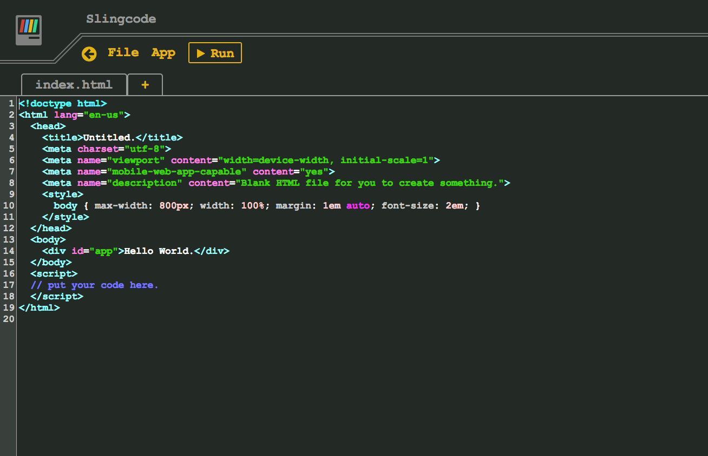

<!--
Ohart ongi: README hau automatikoki sortu da <https://github.com/YunoHost/apps/tree/master/tools/readme_generator>ri esker
EZ editatu eskuz.
-->

# Slingcode YunoHost-erako

[](https://dash.yunohost.org/appci/app/slingcode)  

[](https://install-app.yunohost.org/?app=slingcode)

*[Irakurri README hau beste hizkuntzatan.](./ALL_README.md)*

> *Pakete honek Slingcode YunoHost zerbitzari batean azkar eta zailtasunik gabe instalatzea ahalbidetzen dizu.*  
> *YunoHost ez baduzu, kontsultatu [gida](https://yunohost.org/install) nola instalatu ikasteko.*

## Aurreikuspena

Slingcode is a code editor contained in a single HTML file. Therefore, it has no server component, so all of your data is stored in your browser's cache. However, it is still possible to make web apps, run them, export them, and even share them using peer-to-peer.

### Features:

- You can make, run, and share web apps with it.
- You don't need any complicated tools to use it, just a web browser.
- You don't need a server, hosting, or an SSL certificate to run the web apps.
- You can put Slingcode on a web site, run it from a USB stick, laptop, or phone, and it doesn't need an internet connection to work.
- You can "add to home screen" in your phone's browser to easily access your library of programs on the go.
- You can share apps peer-to-peer over WebTorrent.
- It's private. You only share what you choose.


**Paketatutako bertsioa:** 0.2.2~ynh5

**Demoa:** <https://slingcode.net/slingcode.html>

## Pantaila-argazkiak



## :red_circle: Ezaugarri zalantzagarriak

- **Jatorrizko garapena utzita**: Software honek ez du arduradunik. Denborak aurrera egin ahala funtzionatzeari utziko dio, konpondu gabeko segurtasun arazoak izango ditu, etab.

## Dokumentazioa eta baliabideak

- Aplikazioaren webgune ofiziala: <https://slingcode.net/>
- Erabiltzaileen dokumentazio ofiziala: <https://slingcode.net/screencasts.html>
- Jatorrizko aplikazioaren kode-gordailua: <https://github.com/chr15m/slingcode>
- YunoHost Denda: <https://apps.yunohost.org/app/slingcode>
- Eman errore baten berri: <https://github.com/YunoHost-Apps/slingcode_ynh/issues>

## Garatzaileentzako informazioa

Bidali `pull request`a [`testing` abarrera](https://github.com/YunoHost-Apps/slingcode_ynh/tree/testing).

`testing` abarra probatzeko, ondorengoa egin:

```bash
sudo yunohost app install https://github.com/YunoHost-Apps/slingcode_ynh/tree/testing --debug
edo
sudo yunohost app upgrade slingcode -u https://github.com/YunoHost-Apps/slingcode_ynh/tree/testing --debug
```

**Informazio gehiago aplikazioaren paketatzeari buruz:** <https://yunohost.org/packaging_apps>
